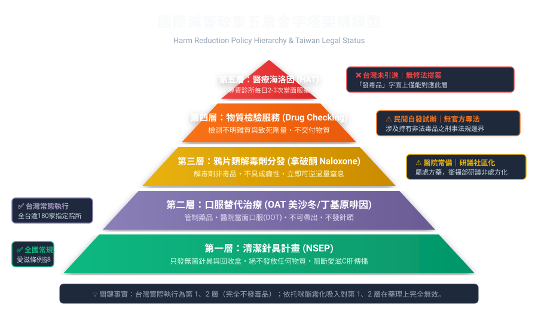
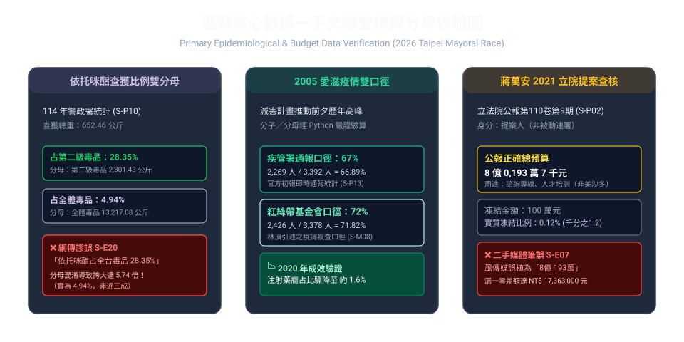

# 來源出處與圖表總覽（超連結＋圖片）

> **用途**：本檔為全 repo 一手文獻、具名聲明、媒體報導、社群監測之「可點擊出處總表」，並附自製查核圖表。
> **證據分級**：P1 一手原始文獻 ✅ 可單獨支撐結論；P2 具名聲明 ⚠️ 須標明為某方說法；P3 具名媒體 ⚠️ 須交叉 ≥2 家；P4 單一／社群 ❌ 不可單獨支撐；X 已查證錯誤 ❌ 引用須標明為錯誤。
> **完整註冊表**：`sources/SOURCE-REGISTRY.md`（76 項實質編號＋79 獨立 URL＋29 項 X 級）
> **TVBS 辯論新增來源**：`docs/04-TVBS電視辯論進展.md`（S-M19～M21、S-N13～N20、S-D01～D08，2026-10-06 新增）；10/07 追蹤為檢索紀錄見 `sources/INTAKE-20261007.md`（不作結案、不改變計數）

---

## 一、自製查核圖表（圖片＋連結）

### 圖 1：國際減害政策五層金字塔架構模型

- **圖片連結**：[public/images/harm-reduction-pyramid.svg](../public/images/harm-reduction-pyramid.svg)
- **對應出處**：S-P03（毒危條例）、S-P12（北市衛生局 4 院區）、S-P13／S-P14（針具法源與試辦）、R3（Wood et al. CMAJ 2004、NAOMI NEJM 2009、Walley BMJ 2013、Cochrane 2017）
- **一句話解讀**：台灣實際執行第 1、2 層（完全不發毒品）；「發毒品」字面上僅能對應第 5 層 HAT；依托咪酯霧化吸入對第 1、2 層藥理上完全無效。

### 圖 2：選戰核心數據一手文獻查核與分母校驗圖

- **圖片連結**：[public/images/data-dual-denominator.svg](../public/images/data-dual-denominator.svg)
- **對應出處**：
  - 依托咪酯雙分母：[警政署統計專區](https://www.npa.gov.tw/ch/app/data/list?module=wg057)（S-P10；652.46／2,301.43＝28.35%，652.46／13,217.08＝4.94%，相差 5.74 倍，見 S-E20）
  - 2005 愛滋雙口徑：[疾管署官網](https://www.cdc.gov.tw/)（S-P13；2,269／3,392＝67%）vs 紅絲帶／林頂 [聯合報導](https://udn.com/news/story/7266/9793822)（S-M08；2,426／3,378＝72%）
  - 立院預算查核：[立法院公報 PDF](https://ppg.ly.gov.tw/ppg/PublicationBulletinDetail/download/communique1/final/pdf/110/09/LCIDC01_1100901.pdf)（S-P02；8 億 0,193 萬 7 千元，凍結 100 萬，見 S-E07）
- **驗算腳本**：`scripts/verify-calculations.py`（29 項全數通過）

---

## 二、P1 一手原始文獻（最高權威，附超連結）

| 編號 | 文獻 | 超連結出處 |
|:--|:--|:--|
| S-P01 | 《想想論壇》2014-09-01 撲馬舊文（本名沈伯洋） | [原文連結](https://www.thinkingtaiwan.net/content/3055) |
| S-P02 | 《立法院公報》第 110 卷第 9 期第（三十一）案 | [公報 PDF](https://ppg.ly.gov.tw/ppg/PublicationBulletinDetail/download/communique1/final/pdf/110/09/LCIDC01_1100901.pdf) |
| S-P03 | 《毒品危害防制條例》現行版（111.5.4） | [法規全文](https://law.moj.gov.tw/LawClass/LawAll.aspx?pcode=C0000008) |
| S-P04 | 釋字第 799 號（性犯罪刑後治療） | [司法院解釋文](https://cons.judicial.gov.tw/docdata.aspx?fid=30&id=310456) · [搜尋](https://cons.judicial.gov.tw/) |
| S-P05 | 釋字第 802 號（跨國婚媒合，全部合憲） | [司法院解釋文](https://cons.judicial.gov.tw/docdata.aspx?fid=30&id=310856) · [搜尋](https://cons.judicial.gov.tw/) |
| S-P06 | 111 年憲判字第 16 號（強制採尿違憲） | [憲法法庭判決](https://cons.judicial.gov.tw/docdata.aspx?fid=10&id=342295) · [搜尋](https://cons.judicial.gov.tw/) |
| S-P07 | 《特定人員尿液採驗辦法》第 11 條 | [法規全文](https://law.moj.gov.tw/LawClass/LawAll.aspx?pcode=I0030026) |
| S-P08 | 《採驗尿液實施辦法》第 14 條 | [法規全文](https://law.moj.gov.tw/LawClass/LawAll.aspx?pcode=I0030029) |
| S-P09 | 教育部校園尿篩要點（112.5.1） | [教育部法令搜尋](https://edu.law.moe.gov.tw/) |
| S-P10 | 警政署統計通報（2025 年查獲統計） | [警政署統計專區](https://www.npa.gov.tw/ch/app/data/list?module=wg057) |
| S-P11 | 行政院公告院臺法字第 1155013102 號（依托咪酯升一級） | [行政院公報資訊網](https://gazette.nat.gov.tw/egFront/) |
| S-P12 | 台北市衛生局新聞稿 2026-10-04 18:35 | [原文連結](https://health.gov.taipei/News_Content.aspx?n=BB5A41BA1E6CA260) |
| S-P13 | 疾管署 2006-03-07 針具試辦成效 | [疾管署官網](https://www.cdc.gov.tw/) |
| S-P14 | 愛滋防治條例第 8 條（針具法源） | [法規全文](https://law.moj.gov.tw/LawClass/LawAll.aspx?pcode=L0020004) |
| S-P15 | 金氏世界紀錄 24 小時 377,004 則 | [官方紀錄頁](https://www.guinnessworldrecords.com/world-records/most-comments-on-a-facebook-item-in-24-hours) |
| S-P16 | 歷年反毒報告書（91–105，已停編） | [反毒資源館](https://antidrug.moj.gov.tw/) |

一手文獻存檔（逐字引述＋查證結論）：`sources/primary/D1-D2-一手文獻存檔.md`

---

## 三、P2 具名聲明（附超連結，須標明立場）

| 編號 | 來源 | 超連結 | 立場 |
|:--|:--|:--|:--|
| S-M01 | 醫師公會全聯會＋精神醫學會聯合聲明 | [三立](https://health.setn.com/news/1917848) · [自由](https://news.ltn.com.tw/news/politics/breakingnews/5596561) | 挺沈／挺減害 |
| S-M02 | 中華民國防疫學會王任賢聲明 | [聯合報全文](https://udn.com/news/story/7266/9794062) | 挺蔣／反減害論述 |
| S-M03 | 杜承哲醫師實名連署 | [ETtoday](https://health.ettoday.net/news/3248735) | 挺沈／挺減害 |
| S-M04 | 疾管署長羅一鈞發文＋受訪 | [聯合](https://udn.com/news/story/7266/9793379) · [央廣](https://www.rti.org.tw/news?uid=3&pid=235706) | 挺減害（公職） |
| S-M05 | 衛福部「減害非鼓勵用毒」 | [衛福部官網](https://www.mohw.gov.tw/)（影音見 R5／R7，Q2 待定） | 挺減害 |
| S-M06 | 黃金舜四道紅線投書 | [ETtoday 雲論](https://forum.ettoday.net/news/3249380) | 有條件支持 |
| S-M07 | 黃三原／吳易澄／陳裕雄（中央社） | [三立轉載](https://www.setn.com/news/1917294) | 中立專業 |
| S-M08 | 林頂 HIV 數據對比 | [聯合](https://udn.com/news/story/7266/9793822) | 挺減害 |
| S-M09 | 台灣減害協會 | [ETtoday](https://health.ettoday.net/news/3249416) | 挺減害 |
| S-M10 | 台灣露德協會 | [公民行動影音](https://www.civilmedia.tw/archives/141400) | 挺減害 |
| S-M11 | 國民黨文傳會新聞稿 | [原文連結](https://www.kmt.org.tw/2026/10/blog-post_869.html) | 挺蔣 |
| S-M12 | 沈伯洋 10-03 受訪 | [Newtalk](https://newtalk.tw/news/view/2026-10-03/1063337) | 自我辯護 |
| S-M13 | 沈伯洋發文回應 | [Newtalk](https://newtalk.tw/news/view/2026-10-03/1063438) | 自我辯護 |
| S-M14 | 張景森臉書（瑞士／荷蘭說出處） | [Newtalk](https://newtalk.tw/news/view/2026-10-04/1063463) | 挺蔣 |
| S-M15 | 黎蝸藤專欄（美沙冬口服關鍵） | [風傳媒](https://www.storm.mg/article/11169703) | 中立分析 |
| S-M16 | 國民黨團記者會／徐巧芯臉書 | [Newtalk](https://newtalk.tw/news/view/2026-10-04/1063465) | 挺蔣 |
| S-M17 | TFC 第 4132 號（Threads 帳號，2026-05-04／05-05 舊案，10-04 被引用） | [查核報告](https://tfc-taiwan.org.tw/fact-check-reports/taiwan-threads-94m-users-data-error) | 查核（非本案三爭點） |
| S-M18 | 「大橋底下臨時工」自曝程式 | [CDNS](https://www.cdns.com.tw/articles/1469850) | 唯一有物證（反蔣方向） |
| S-M19 | 蔣辦發言人陳柏翰（TVBS 同意） | [中時 10/05](https://www.chinatimes.com/realtimenews/20261005003883-260407) | 蔣陣營正式表態（P2） |
| S-M20 | 沈辦發言人蔡一愷（全簽聲明） | [中央社 10/06](https://www.cna.com.tw/news/aipl/202610060103.aspx) | 沈陣營正式表態（P2） |
| S-M21 | TVBS 官方（P3 轉引降級）（協商中未定論） | 經 [Taiwan News](https://www.taiwannews.com.tw/zh/news/6452552)／[今周刊](https://www.businesstoday.com.tw/article/category/183027/post/202610060016/)轉引（查無一手直連） | 主辦方口徑（P3） |

---

## 四、P3 具名媒體＋中立媒體（附超連結）

| 編號 | 來源 | 超連結 |
|:--|:--|:--|
| S-N01 | 央廣 RTI 羅一鈞專訪 | [原文連結](https://www.rti.org.tw/news?uid=3&pid=235706) |
| S-N02 | 自由時報 沈承認原文 | [原文連結](https://news.ltn.com.tw/news/politics/breakingnews/5594896) |
| S-N03 | 自由時報 蔣三問＋破 50 萬 | [原文連結](https://news.ltn.com.tw/news/politics/breakingnews/5595741) |
| S-N04 | 自由時報 留言曲線 | [原文連結](https://news.ltn.com.tw/news/politics/breakingnews/5594691) |
| S-N05 | 自由時報 連署 7,357 人 | [原文連結](https://news.ltn.com.tw/news/politics/breakingnews/5596197) |
| S-N06 | 聯合報 陳菁徽質疑 | [原文連結](https://udn.com/news/story/124652/9792207) |
| S-N07 | 聯合報 殷瑋專欄 | [原文連結](https://udn.com/news/story/124652/9793298) |
| S-N08 | 聯合報 韋淳祐／鈕則勳 | [原文連結](https://udn.com/news/story/124652/9794540) |
| S-N09 | 風傳媒 48 萬 | [原文連結](https://www.storm.mg/article/11169668) |
| S-N10 | 風傳媒 金額誤植（已知錯誤） | [原文連結](https://www.storm.mg/lifestyle/11169648) |
| S-N11 | 中時 沈政男二手（無公開 URL） | ⚠️ 僅 R5 轉述，不可單獨引用 | P4 |
| S-N12 | ETtoday HIV 數據 | [原文連結](https://health.ettoday.net/news/3248802) |
| S-N13 | 中時 蔣辦 TVBS 定調 | [原文連結](https://www.chinatimes.com/realtimenews/20261005003883-260407) |
| S-N14 | 中央社 沈拋毒品辯論／蔣接招 | [原文連結](https://www.cna.com.tw/news/aipl/202610060103.aspx) |
| S-N15 | 自由 雙方已簽 TVBS | [原文連結](https://news.ltn.com.tw/news/politics/breakingnews/5597336) |
| S-N16 | ETtoday 全簽 vs 只簽 TVBS | [原文連結](https://www.ettoday.net/news/20261006/3249706.htm) |
| S-N17 | 三立 SETN 辯論共識 | [原文連結1](https://www.setn.com/news/1918035) · [原文連結2](https://www.setn.com/news/1917968) |
| S-N18 | 民視 四家邀約日期 | [原文連結](https://www.ftvnews.com.tw/news/detail/2026A06P07M1) |
| S-N19 | TNL 關鍵評論彙整 | [原文連結](https://www.thenewslens.com/article/270421) |
| S-N20 | Taiwan News 09/05 辯論意願 | [原文連結](https://www.taiwannews.com.tw/news/6434625) |
| S-PTS1 | 公視 平衡報導兩造原話 | [原文連結](https://news.pts.org.tw/article/829848) |
| S-PTS2 | 公視 針具機實拍＋居民訪談 | [原文連結](https://news.pts.org.tw/article/829933) |
| S-D01 | 公視 PNN 10/06 辯論聯訪 | [原文連結](https://news.pts.org.tw/article/830098) | P2 |
| S-D02 | 央廣 RTI 10/05 衛福部三策略 | [原文連結](https://www.rti.org.tw/news?uid=3&pid=235837) | P3 |
| S-D03 | 鏡週刊 10/05 卡關放話 | [原文連結](https://www.mirrormedia.mg/story/20261005edi013) | P4 |
| S-D04 | Newtalk 10/06 周軒同意書 | [原文連結](https://newtalk.tw/news/view/2026-10-06/1063874) | P4 |
| S-D05 | 自由 09/22 信民民調 | [原文連結](https://news.ltn.com.tw/news/politics/breakingnews/5581917) | P3 |
| S-D06 | Newtalk 蔣反問 Yes or No | [原文連結](https://newtalk.tw/news/view/2026-10-06/1063967) | P4 |
| S-D07 | 民視快新聞 沈受訪順序 | [原文連結](https://www.ftvnews.com.tw/news/detail/2026A06W0149) | P3 |
| S-D08 | 今周刊／Taiwan News 中文版轉引 | [今周刊](https://www.businesstoday.com.tw/article/category/183027/post/202610060016/) · [Taiwan News](https://www.taiwannews.com.tw/zh/news/6452552) | P3 |

P4 社群／單一來源（含圖片／影片連結）：

- S-C01 三立 37.8 萬：[原文連結](https://www.setn.com/news/1917342)
- S-C03 王婉諭評論：[原文連結](https://www.zmedia.com.tw/Document/NewsDetail/44504)
- S-C04 PTT 破金氏紀錄：[原文連結](https://www.ptt.cc/bbs/HatePolitics/M.1791083666.A.607.html)（附社群截圖討論串）
- S-C05 PTT 黃國昌批連署：[原文連結](https://www.ptt.cc/bbs/HatePolitics/M.1791187453.A.3CA.html)
- S-C02 中時沈政男另一報導：⚠️ 無公開 URL（nextapple 20261004000031，僅 R5 轉述，不可引用）
- S-C06 PTT 灌爆串：[原文連結](https://disp.cc/ptt/b/Gossiping/igE7)
- S-C07 PTT 金氏紀錄問卦：[原文連結](https://disp.cc/ptt/b/Gossiping/1gmQzkST)
- S-C08 TVBS YouTube 新聞影片：[影片連結](https://www.youtube.com/watch?v=-s9NloSbkwo)（🎬 影音出處）
- S-C09 天下雜誌：[連結](https://www.cw.com.tw/article/5143167)（已 403，保留僅供核查，不採用）

---

## 五、圖片出處說明

- 自製 SVG 兩張為本 repo 原創（CC BY 4.0），數據均回溯 P1 公報並經 `verify-calculations.py` 驗算。
- 網傳「14 小時 38 萬」截圖：本 repo 未收錄原圖（版權屬 Facebook 介面截圖），以文字記載時點（10/04 11:07 達 37.8 萬）＋出處鏈（[三立 S-C01](https://www.setn.com/news/1917342)、[PTT S-C04](https://www.ptt.cc/bbs/HatePolitics/M.1791083666.A.607.html)）代替，避免侵權轉載。
- PTT／Dcard 社群截圖一律以超連結出處代替內嵌圖片，遵循「引用時標明其為 P4 社群監測、不可單獨支撐結論」原則。
